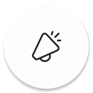

[![LinkedIn][linkedin-shield]][linkedin-url]

 

  

<h3 align="center">Chat</h3>

  

    Bem vindo ao Projeto Chat
  

## Sobre o projeto

Este é um projeto Android desenvolvido em Kotlin que tem como objetivo aprimorar meu conhecimento sobre o desenvolvimento Android moderno. O projeto abrange diversas funcionalidades e utiliza as mais recentes práticas recomendadas para a criação de aplicativos Android de alta qualidade utilizando Compose.

## Funcionalidades Implementadas

1. **Acesso à Câmera e Galeria:** O projeto permite aos usuários capturarem fotos utilizando a câmera do dispositivo ou selecionarem imagens da galeria. Isso é alcançado através da integração cuidadosa com as APIs do Android relacionadas.

2. **Navigation Component:** A navegação dentro do aplicativo é gerenciada eficientemente por meio do Navigation Component. Isso facilita a criação de uma experiência de usuário fluída e coerente.

3. **Hilt - Injeção de Dependência:** O Hilt é utilizado para uma gerenciamento de dependências simplificado e mais legível. Isso promove a modularização e facilita a manutenção do código.

4. **Testes:** Uma suíte de testes abrangente é implementada para garantir a robustez das funcionalidades. Testes unitários e de instrumentação são realizados para manter a estabilidade do aplicativo.

5. **Detekt:** O Detekt é uma ferramenta de análise estática de código para projetos Kotlin, com foco especial em projetos Android. Ele é usado como uma alternativa ao lint padrão do Android e fornece análises mais detalhadas e personalizáveis para melhorar a qualidade e a consistência do código.

6. **Ktor:** O Ktor é um framework assíncrono de código aberto para construir aplicativos de servidor e cliente em Kotlin. Ele é projetado para ser conciso, expressivo e altamente flexível, permitindo o desenvolvimento de aplicações web e móveis de maneira eficiente.

(<a href="#readme-top">voltar ao topo</a>)

## Licença

Este projeto é licenciado sob a `LICENSE.txt`, o que significa que você pode usá-lo livremente para fins educacionais e pessoais.

(<a href="#readme-top">voltar ao topo</a>)

## Contact

Gabriel Ramos - [@bed72](https://github.com/bed72) - developer.bed@gmail.com

Link do Projeto: [https://github.com/bed72/Chat](https://github.com/bed72/Hogwarts)

(<a href="#readme-top">voltar ao topo</a>)

[linkedin-shield]: https://img.shields.io/badge/-LinkedIn-black.svg?style=for-the-badge&logo=linkedin&colorB=555
[linkedin-url]: https://www.linkedin.com/in/gabriel-ramos-bed/
